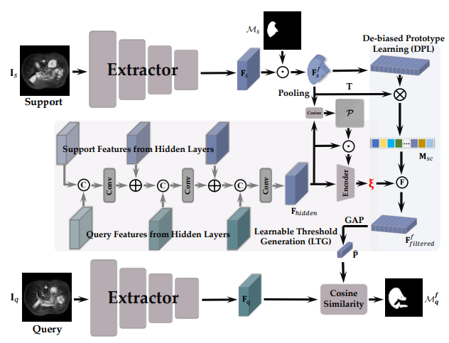

# DMAP
The official implementation of paper: Learning De-biased Prototypes for Few-Shot Medical Image Segmentation

<p align="center">


## Brief Introduction  
Prototypical networks have emerged as the dominant method for Few-shot Medical image Segmentation (FSMIS). Despite their success, the commonly used Masked Average Pooling (MAP) approach in prototypical networks computes the mean of the masks, resulting in imprecise and inadequate prototypes that fail to capture the subtle nuances and variations in the data. To address this issue, we propose a simple yet effective module called De-biasing Masked Average Pooling (DMAP) to generate more accurate prototypes from filtered foreground support features. Specifically, our approach introduces a Learnable Threshold Generation (LTG) module that adaptively learns a threshold based on the extracted features from both support and query images, and then choose partial foreground pixels that have larger similarity than the threshold to generate prototypes.

## Getting started

### Dependencies
Please install following essential dependencies:
```
dcm2nii
json5==0.8.5
jupyter==1.0.0
nibabel==2.5.1
numpy==1.22.0
opencv-python==4.5.5.62
Pillow>=8.1.1
sacred==0.8.2
scikit-image==0.18.3
SimpleITK==1.2.3
torch==1.10.2
torchvision=0.11.2
tqdm==4.62.3
```

### Data sets and pre-processing
Download:
1) [Combined Healthy Abdominal Organ Segmentation data set](https://chaos.grand-challenge.org/)
2) [Multi-sequence Cardiac MRI Segmentation data set](https://zmiclab.github.io/projects/mscmrseg19/) (bSSFP fold)
3) [Multi-Atlas Abdomen Labeling Challenge](https://www.synapse.org/#!Synapse:syn3193805/wiki/218292)

Pre-processing is performed according to [Ouyang et al.](https://github.com/cheng-01037/Self-supervised-Fewshot-Medical-Image-Segmentation/tree/2f2a22b74890cb9ad5e56ac234ea02b9f1c7a535) and we follow the procedure on their github repository.

### Training
1. Compile `./supervoxels/felzenszwalb_3d_cy.pyx` with cython (`python ./supervoxels/setup.py build_ext --inplace`) and run `./supervoxels/generate_supervoxels.py` 
2. Download pre-trained ResNet-101 weights [vanilla version](https://download.pytorch.org/models/resnet101-63fe2227.pth) or [deeplabv3 version](https://download.pytorch.org/models/deeplabv3_resnet101_coco-586e9e4e.pth) and put your checkpoints folder, then replace the absolute path in the code `./models/encoder.py`.  
3. Run `./script/train.sh` 

### Inference
Run `./script/test.sh` 

## Citation
```bibtex
@article{zhu2024learning,
  title={Learning De-biased prototypes for few-shot medical image segmentation},
  author={Zhu, Yazhou and Cheng, Ziming and Wang, Shidong and Zhang, Haofeng},
  journal={Pattern Recognition Letters},
  year={2024},
  publisher={Elsevier}
}
```


